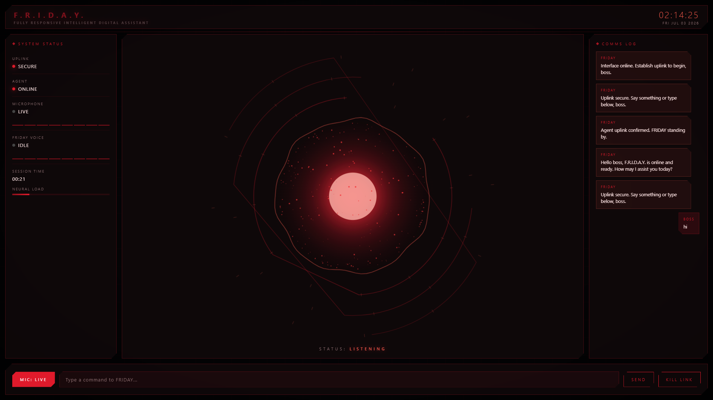

# 🤖 F.R.I.D.A.Y. — Voice AI Assistant

**Tony Stark-inspired voice AI assistant** with real-time speech, an Ultron-style cinematic command dashboard, and MCP-powered tools. Say "Hello Friday" and it talks back — with web search, news, and system tools built in. Free & open source.

   

---

## ✨ Features

- 🎙️ Real-time voice conversation — talk naturally, no wake-word lag
- 🧠 Google Gemini 2.0 Flash — fast, capable reasoning
- 🔊 Deepgram STT + TTS — low-latency speech in and out
- 🛠️ MCP tool server — web search, live news, system info, extensible
- 🖥️ Ultron-style dashboard — audio-reactive particle core, live comms log, system status panel, text chat fallback
- 🔐 Self-hosted — your keys, your data, runs on your machine

---

## 🏗️ Architecture

    Microphone -> STT (Deepgram) -> LLM (Gemini 2.0 Flash) <-> MCP Server (web search, news, system info)
    LLM -> TTS (Deepgram) -> Speaker / Dashboard

- STT: Deepgram (real-time speech recognition)
- LLM: Google Gemini 2.0 Flash
- TTS: Deepgram
- Tools: FastMCP server (web search, news, system info)
- Voice Pipeline: LiveKit Agents
- Dashboard: Custom HTML/Canvas Ultron-style command interface

---

## 📁 Project Structure

friday-assistant/
- src/agent_friday_new.py (Voice agent entrypoint)
- src/server.py (MCP tool server)
- src/gen_token.py (LiveKit token generator)
- assets/friday-preview.png
- friday-dashboard.html (Command dashboard UI)
- .env.example
- pyproject.toml
- README.md

---

## 🚀 Quick Start

### 1. Install dependencies

    pip install uv
    uv sync
    uv add livekit-api

### 2. Configure environment

    cp .env.example .env

Fill in your API keys.

### 3. Run the agent

    # Terminal 1 - MCP Tool Server
    uv run python src/server.py

    # Terminal 2 - Voice Agent
    uv run python src/agent_friday_new.py

### 4. Launch the dashboard

    uv run python src/gen_token.py

Open friday-dashboard.html in your browser, paste the LiveKit URL and generated token, and click Establish Uplink. Say "Hello Friday" 🎙️

---

## 🔑 Required API Keys

| Key | Get it from |
|---|---|
| LIVEKIT_URL + LIVEKIT_API_KEY + LIVEKIT_API_SECRET | livekit.io |
| GOOGLE_API_KEY | aistudio.google.com |
| DEEPGRAM_API_KEY | console.deepgram.com |
| GROQ_API_KEY | console.groq.com |

All providers have generous free tiers — you can run this at zero cost.

---

## 🗺️ Roadmap

- [ ] Persistent conversation memory
- [ ] Custom wake-word detection
- [ ] Multi-agent tool routing
- [ ] Mobile-friendly dashboard layout
- [ ] Local LLM fallback (Ollama)

---

## 🙏 Credits

Built on the shoulders of LiveKit Agents, Deepgram, Google Gemini, and FastMCP.

## 📄 License

MIT — see [LICENSE](LICENSE)

---

Inspired by Tony Stark's F.R.I.D.A.Y. This is an independent fan project, not affiliated with Marvel Entertainment or The Walt Disney Company.
